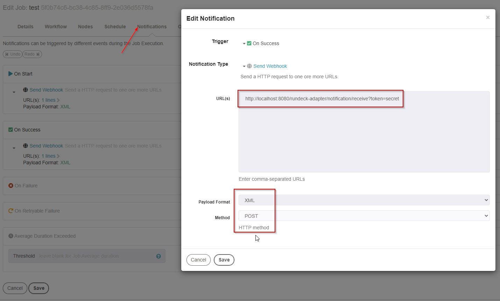

# About

This is a WAR file, which offers webhooks for [Rundeck](https://www.rundeck.com/) notification messages. The messages can be routed to third party systems. In the example the notifications 

- are logged as XML and 
- are routed to a [Zulip chat server](https://zulip.com/).

My motivation was to get some hands on java microprofile - especially metrics and config.

## Modules

- `rundeck-adapter-base` - api and utilities
- `rundeck-zulip-adapter` - logic to send messages to zulip
- `rundeck-adapter-app` - servlet dependencies, rest controller

# Compile

```
mvn clean install
```

# Deployment

```
jboss-cli.bat jboss-cli.bat --connect --controller=localhost:9990 ^
  --command="deploy rundeck-adapter-app\target\rundeck-adapter.war --force --name=rundeck-adapter.war --runtime-name=rundeck-adapter.war"
```

Tested with Wildfly 14.

# Testing

Get a REST Client and call:

```
POST http://localhost:8080/rundeck-adapter/notification/receive?token=secret
content-type: text/xml
accept: text/xml
```

For a sample body see this [sample-notification](rundeck-zulip-adapter/src/test/resources/sample-notification.xml).

To view the metrics, visit `http://localhost:8080/rundeck-adapter/metrics`

## Configure Rundeck



_Use rundeck to send notifications to the rundeck-adapter webapp._

# Logging

Set the log level of these classes to TRACE, to see everything, use this jboss cli commands:

```
/subsystem=logging/logger=de.servicezombie.rundeck:add(level=TRACE)
/subsystem=logging/logger=de.servicezombie.zulip:add(level=TRACE)
/subsystem=logging/logger=de.servicezombie.thymeleaf:add(level=TRACE)

# See XML Notifications in logfile
/subsystem=logging/logger=de.servicezombie.rundeck.XML:add(level=INFO)
```

# Adding own modules

Adding your own implementation requires some hands on. 

- Clone the sources.
- Add your own module by copy the zulip module and refer to it in the parent-pom.
- Implement the interface `NotificationService`. 
- To make it beeing called, configure `rundeck-adapter-app` to use your module instead of the zulip example. CDI should find your implemenation, since it is the only one, on the classpath.

